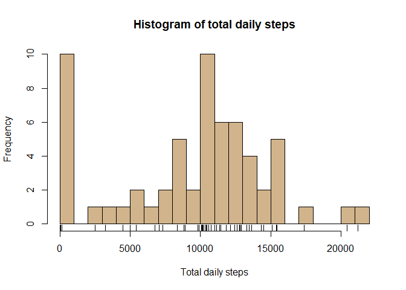
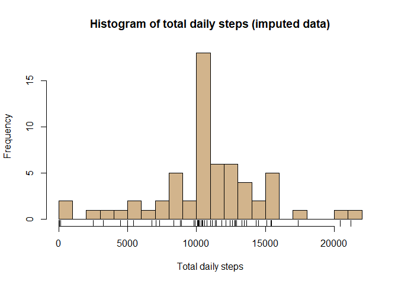
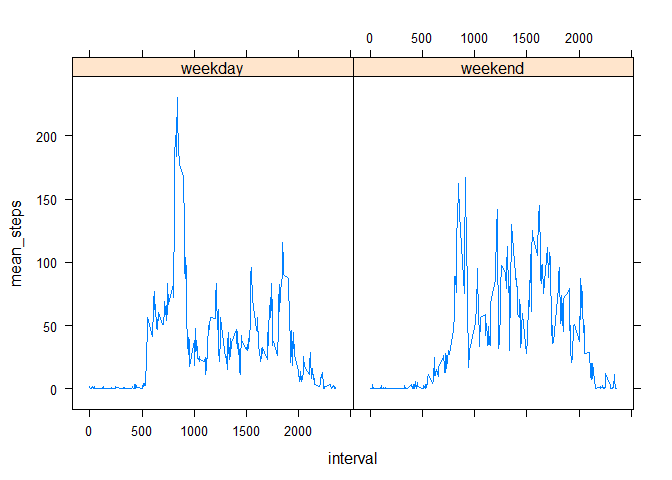

# Reproducible Research: Peer Assessment 1

This report contains an exploratory description of data collected by a personal activity monitoring device.  This device collects data at 5 minute intervals through out the day. The data consists of two months of data from an anonymous individual collected during the months of October and November, 2012 and include the number of steps taken in 5 minute intervals each day.  


## Loading and preprocessing the data

The data file was downloaded from the Coursera course website (Reproducible Research, week 2 project).  A summary of the number of observations and variables is shown below:  


```r
act.data <- read.csv('H:\\Courses\\Coursera\\Reproducible\\Week2\\activity.csv')
str(act.data)
```

```
## 'data.frame':	17568 obs. of  3 variables:
##  $ steps   : int  NA NA NA NA NA NA NA NA NA NA ...
##  $ date    : Factor w/ 61 levels "2012-10-01","2012-10-02",..: 1 1 1 1 1 1 1 1 1 1 ...
##  $ interval: int  0 5 10 15 20 25 30 35 40 45 ...
```

Date identifies the date of the measurement.
Interval is a numeric identifier of the specific 5-minute interval of the measurement.
Steps is the number of steps taken in the five minute interval.

\  

## What is mean total number of steps taken per day?


```r
library(dplyr)

act.data %>% 
    group_by(date) %>%
    summarize(total_steps = sum(steps, na.rm=T)) -> steps.by.date

mean.steps <- as.integer(mean(steps.by.date$total_steps, na.rm = T))
median.steps <- as.integer(median(steps.by.date$total_steps, na.rm = T))
```


```r
hist(steps.by.date$total_steps, 
     breaks=20,
     xlab = 'Total daily steps',
     main = 'Histogram of total daily steps',
     col = 'tan')
rug(steps.by.date$total_steps)
```

<!-- -->

The mean total number of steps taken per day is 9354 and the median is 10395.

\  

## What is the average daily activity pattern?


```r
act.data %>% 
    group_by(interval) %>%
    summarize(mean_steps = mean(steps, na.rm=T)) -> steps.by.interval

interval.max.steps <- steps.by.interval$interval[which.max(steps.by.interval$mean_steps)]

with(steps.by.interval, 
        plot(interval, mean_steps,
                type = 'l'),
                main = 'Mean steps by interval')
```

<!-- -->

The interval with the maximum average steps was 835. 

\  

## Imputing missing values

If the number of steps is missing for an interval on a single day, set the imputed value to the mean number of steps for that interval over all days.


```r
missing.count <- sum(is.na(act.data$steps))

imputed.data <- merge(act.data, steps.by.interval, by = 'interval')

imputed.data <- mutate(imputed.data, steps = ifelse(is.na(steps), mean_steps, steps))
```

There were 2304 intervals with missing step counts.  A histogram showing the imputed data is shown below:  


```r
imputed.data %>% 
    group_by(date) %>%
    summarize(total_steps = sum(steps)) -> steps.by.date.imp

hist(steps.by.date.imp$total_steps, 
     breaks=20,
     xlab = 'Total daily steps',
     main = 'Histogram of total daily steps (imputed data)',
     col = 'tan')
rug(steps.by.date$total_steps)
```

<!-- -->

```r
mean.steps.imp <- as.integer(mean(steps.by.date.imp$total_steps))
median.steps.imp <- as.integer(median(steps.by.date.imp$total_steps))
```

The mean total number of steps taken per day is 10766 and the median is 10766.  If a date is missing all measurements, this imputation procedure makes the total number of steps on the imputed days equal to the mean of all other days.  Enough dates were assigned that mean value that it actually becomes the median also.

\  

## Are there differences in activity patterns between weekdays and weekends?


```r
imputed.data %>%
    mutate(day = weekdays(as.Date(date)),
           day_type = ifelse(day %in% c("Saturday","Sunday"), "weekend", "weekday")) %>%
    group_by(interval, day_type) %>%
    summarize(mean_steps = mean(steps, na.rm=T)) -> steps.by.interval.weekend


library(lattice)
xyplot(mean_steps ~ interval | day_type,
       data = steps.by.interval.weekend,
       type = 'l')
```

<!-- -->

